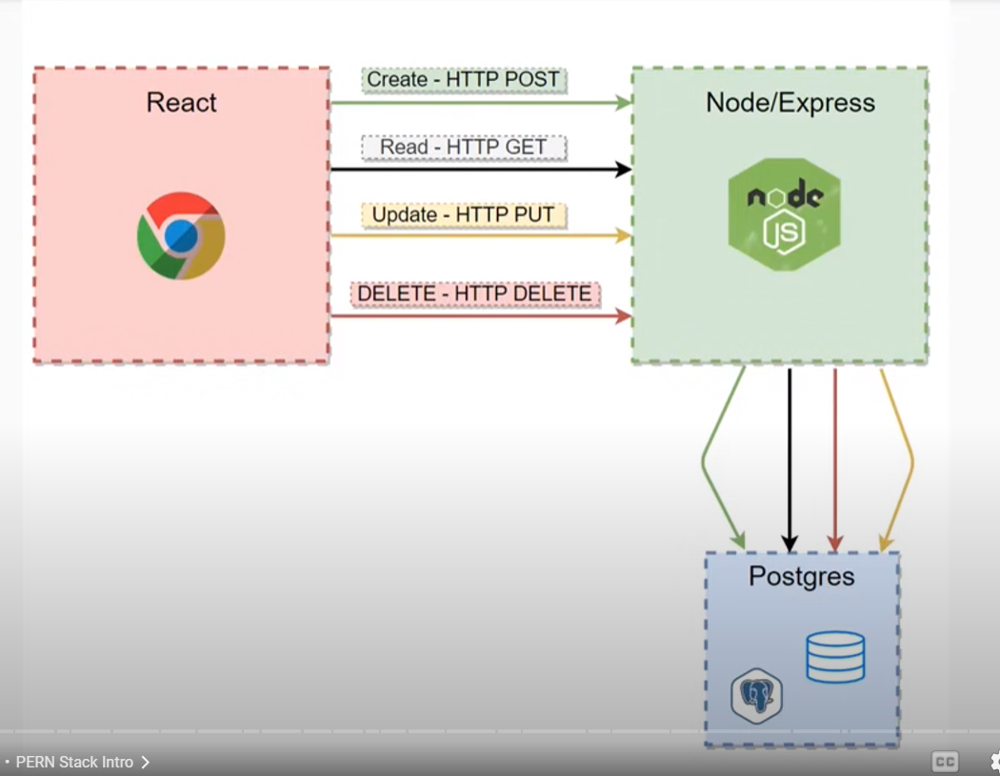
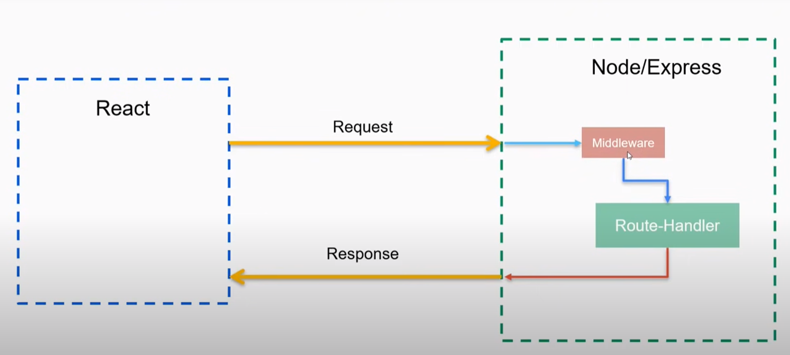

# Resturant Finder App

[PERN Stack Course - Build a Yelp clone (Postgres, Express, React, Node.js)](https://www.youtube.com/watch?v=J01rYl9T3BU&list=PLxk1NDS82Cw4wBTQcKfkFLu457mRdPp9c&index=15&t=45s)

## Run the app

1. Terminal cd ./server `npm start` or `./server.js`
   - starts server node.js express app
2. Terminal cd ./client `npm start`
   - starts react front end app
3. Not needed but to open psql database
   - `psql -U postgres`
   - Connect to yelp database: `\c yelp`
   - List tables `\d`

⭐️ Course Contents ⭐️
⌨️ (0:00:00) Intro
⌨️ (0:04:11) PERN Stack Intro
⌨️ (0:07:58) Postgres Windows Install
⌨️ (0:16:35) Postgres Mac install
⌨️ (0:29:13) Postgres Documentation
⌨️ (0:30:29) PSQL Basics
⌨️ (0:37:04) SQL Tables
⌨️ (0:38:53) Create Table
⌨️ (0:45:55) Modify Tables
⌨️ (0:48:28) Delete Databases
⌨️ (0:50:58) Yelp Project Database
⌨️ (1:09:57) Node Setup
⌨️ (1:12:45) Express Setup
⌨️ (1:15:57) Environment Variables
⌨️ (1:19:40) First Express Route
⌨️ (1:29:27) Restful API Convention
⌨️ (1:32:33) Configure all routes
⌨️ (1:42:34) Express Middleware
⌨️ (1:54:13) Finishing Up Routes
⌨️ (2:03:10) Connect Express and Postgres
⌨️ (2:14:20) Get all Restaurants Route
⌨️ (2:18:25) Gone one Restaurant Route
⌨️ (2:28:23) Create a Restaurant Route
⌨️ (2:35:28) Update A Restaurant Route
⌨️ (2:43:07) Delete A Restaurant Route
⌨️ (2:46:28) React Setup
⌨️ (2:52:52) React Router Setup
⌨️ (3:02:03) HomePage Layout
⌨️ (3:14:24) React Context API
⌨️ (3:20:17) Fetching Data
⌨️ (3:36:12) Rendering Restaurants
⌨️ (3:41:48) Adding Restaurants
⌨️ (3:56:26) Deleting Restaurants
⌨️ (4:03:05) Updating Restaurants
⌨️ (4:26:18) Detail Page
⌨️ (4:38:06) Reviews Intro
⌨️ (4:39:46) Reviews Postgres Table
⌨️ (4:55:20) Star Rating Component
⌨️ (5:02:49) Reviews Component Layout
⌨️ (5:08:18) Add Review
⌨️ (5:29:06) Add Review Express Route
⌨️ (5:37:43) Add Review React Component
⌨️ (5:48:04) Postgres Aggregate Functions
⌨️ (5:57:26) SQL Joins and Wrapping up App

## Intro:

- Table Database with:

  - Name, Location, Price range, Ratings, Edit, Delete
  - Functions = Add, Update, Delete, View/Detailed page
  - Reviews = view and create reviews

- Topics Covered:
  - PERN
  - Create PostgreSQL database, tables, columns, edit/modify, Foreign Keys

## PERN Stack

- Postgres Database to store all data
  - Store list of Restaurant and reviews
- Express JS and Nodejs
  - Nodejs runs on java on server side
  - ExpressJS webserver framework
- React.JS
  - Sending request to API setup in Express JS for Front end template


    
- shows how the parts connect
- HTTP POST, GET, PUT, DELETE sent from React -> Node/Express
- Node/Express completes those operations to the Postgres SQL database

---

## Window Install Postgres

- Google postgresql.org and download windows version installer from enterprisedb page.
- Download latest PostgreSQL version
- Run through installer
- Select default directory
- Needs: PostgreSQL Server, pgAdmin 4 (gui), Stack Builder, and CLI Tools
- Create superuser and password. Store these
- Select Port to use (5432 Default)

### Setup SQL on local machine

- open PSQL (terminal of SQL) under PostgresSQL from start menu
- Connect local host (127.0.0.1) or if connecting to server held database input it's IP address here.
- Connect to name of database. Default database made during install (postgres)
- Input Port: 5432 or what you put during install
- Username: input your username created
- Password: input your password
- This will then open the database in terminal
- add C/Program Files/PostgreSQL/Version/bin/psql to PATH
- Add this path to Enviornment Variables in PATH.

## Postgres Documentation

- Open Postrgres Documentation page
  - [PostgreSQL Documentation](https://www.postgresql.org/docs/15/index.html)
  - [PostgresSQL Tutorial](https://postgresqltutorial.com/)

## PSQL Basic Commands

- cmd starts with `\`
- `\?` for help
- `\l` - list all databases on server
- `CREATE DATABASE database_name`
  - Create a databse
- `\c database`

  - Connect to database

- Create table

```
CREATE TABLE [IF NOT EXISTS] table_name (
   column1 datatype(length) column_contraint,
   column2 datatype(length) column_contraint,
   column3 datatype(length) column_contraint,
   table_constraints
);

```

```
CREATE TABLE products (
    id INT,
    name VARCHAR(50),
    price INT,
    on_sale BOOLEAN
);
```

- Create a table in a database
- `\d`
  - list tables
- `ALTER TABLE products ADD COLUMN featured BOOLEAN;`
  - Add a column to a table
- `ALTER TABLE products DROP COLUMN featured;`
  - Drop a column from a table
- `DROP TABLE products;`
  - Drop/delete table
- `DROP DATABASE name;`

  - Delete database

- `UDPATE {table} SET {column} = {value} WHERE {column_search} = {value}`
  - update a row in a table

## Example Yelp Table

- Create a yelp table for resturants
  - BIGSERIAL - force a unique ID
  - PRIMARY KEY - set indexing on primary key
  - Constraints:
    - NOT NULL - force data required for field to add
    - 1 <= price_range <= 5

```
CREATE TABLE restaurants (
    id BIGSERIAL NOT NULL PRIMARY KEY,
    name VARCHAR(50) NOT NULL,
    location VARCHAR(50) NOT NULL,
    price_range INT NOT NULL check(price_range >= 1 and price_range <=5)
);
```

Insert Data

```
-- Insert some data
INSERT INTO restaurants( name, location, price_range) VALUES ('pizza hut', 'vegas', 2 ) RETURN *;

```

Update Data

```
- `UDPATE resturants SET {column} = {value} WHERE {column_search} = {value}`
  - update a row in a table
```

Delete Data

```
DELETE FROM restaurants WHERE id = {id value}
```

## Node.JS

- Download from nodejs.org
- Two directories to organize project "yelp"
  - client
  - server
- cd into server

  - `npm init -y`
  - create package.json file
  - `npm install express`

    - package.json file should now hve dependecies "express"
    - package-lock.json
    - node_modules

  - server.js
    - entry point to backend. Create express app, listening on port
    - import express
    - create obj instance of express
    - listen on port(3005) give callback function

- run server
  - `node server.js`

### Enviornment Variables

- avoid hard coding values between development and production env variables
- dotenv - package for managing enviornment variables
- install with `npm install dotenv`
- import with `require("dotenv").config();`
- create a `.env` file
- use with `process.env.{.env variable} || {dafault value if undefind}`

### express route

- route for each CRUD/REST api
  - CREATE, GET, UPDATE, DELETE
- `app.get("/url_end_point")`
  - http://localhost:3001/getRestaurants
  - When going to this address it will go to this function's callback
- app.post
- app.patch
- app.put

#### Postman

- Test APIs and server when front end is not done. The post, create, update, delete crud commands will not run using web page url.
- Can construct any HTTP method you want (post, put, patch, etc.)
- an add headers, authorization,

## Restaurant Routes - Restful API Convetions

<table>
    <tr>
        <th>Crud Operation</th>
        <th>Method</th>
        <th>URL</th>
    </tr>
    <tr>
        <td>Retrieve All Restaurants</td>
        <td>GET</td>
        <td>/api/v1/restaurants</td>
    </tr>
    <tr>
        <td>Retrieve One Resturant</td>
        <td>GET</td>
        <td>/api/v1/restaurants/:id</td>
    </tr>
    <tr>
        <td>Create Restaurant</td>
        <td>POST</td>
        <td>/api/v1/restaurants</td>
    </tr>
    <tr>
        <td>Update Restaurant</td>
        <td>PUT</td>
        <td>/api/v1/restaurants/:id</td>
    </tr>
    <tr>
        <td>Delete Restaurant</td>
        <td>DELETE</td>
        <td>/api/v1/restaurants/:id</td>
    </tr>
</table>

- Naming convention
  - api - know route is api in application
  - v1 - set flexiblity to have users use old v1 version of api while v2 can be setup for "testing" then just change front end routes
  - `:<id>` id can be any value to retrieve individual restaurant
  - PUT - update, could also use PATCH. Needs the `id` cause you have to update only one restaurant.
    - PUT needs ALL params of line to update
  - DELETE with id as well.

## Configuring routes from table

- Setup skeleton of routes

- get `/api/v1/restaurants/:id` req review

  - params: {id: '<value passed from http request>'}

- POST `/api/v1/restaurants`
  - use post function in express
  - postman uses body -> raw -> json fill json file to post it.
  - data is retrieved in middleware

## Aside: Middleware



- Middleware sits between route-handler and the request. It will adjust data as needed before sedning it back.
- It has access to Request and Response.
- Can reduce code complexity if used properly.
- Defined as another callback
- applies to all requests coming in
- Each app.get/post/delete is a middleware, these are just the last middleware to call.
- Requires `app.use( (req, res, next) => callback)`

  - next needs to be called to pass to next handler.

- Middleware is called in order it is placed in script. The route searching for first matching request route. It is sequential, so can run multiple middleware packs

- Third party middleware:
  - Morgan a logger middleware
    - `npm i morgan`
    - `const morgan = require("morgan");`
    - `app.use(morgan("format type"))`
  - express.json()
    - comes with express and converts body of post message to json
    - adds `req.body` object

## Connecting PostgreSQL database to express

[node-postgres](www.node-postgres.com)

- Use guides/Express with async/await and suggested Proejct structure

Setup the scripts with ./server/db/index.js following guide of Express with async/await from website.

Recommend to setup connection with .env variables over hardcoding.

**Warning:** do not use Template Strings for SQL query inputs. This is vulnerable to SQL Injection. Instead use **Parameterized Queries**

# React front end

- Change directory to `client` folder
- install react `$npm install create-react-app -g`
- run `create-react-app .`
  - this creates src fodler and new app application. Delete all files in src
  - Create index.js
  - App.jsx
- Use ES7React/Redux/Graph VS code extension

in App.jsx

- define app
- export default app

index.js

- import APp from ./App
- render the /App on root

Sytling Bootstrap and font awesome

- copy bootstrap .css style sheet link and put in <head> of index.html
  - [Bootstrap](https://getbootstrap.com/docs/5.3/getting-started/introduction/)
- copy fontawesome into .css style sheet link into <head> of index.html. Search from **cdnjs**
  - [cdnjs lookup](https://cdnjs.com/libraries/font-awesome)

## React Router Setup

Front end routes not dependent on backend route names. Pages to make are:

- Home page: `/`
- Restaurant details: `/restaurants/:id`
  - Gives each restaurant their own pag
- UPdate Restaurant: `/restaurants/:id/update`

Requires library for routing: `React Router` : `npm install react-router-dom`

Folder structure, add files:

- src/routes/Home.jsx UpdatePage.jsx, RestaurantdetailPage.jsx

### Create a skeleton for route pages:

- `rafce` to create template React page for each page

### Setup App.jsx

- import BrowserRouter - Router, Routes, route from react-router-dom
- routes defined in `<Router>` tag
  - Route exact page "/" component={}

## React Page layouts

Folder Structure:

- Components kept in `./client/src/components/file.jsx`
- Routes pages kept in `./client/src/routes/file.jsx`
- Top level app in `./client/src/App.jsx`

Importing components -> routes -> App.jsx

### HomePage Layout

Includes components:

- Header
- Add restaurant
- List restaurants

Style them with `rafce` for template:

- Use bootsrap classes for styling and HTML to be returned
- place HTML into the `return` of each `const <component> = () => {return()}` then `export dafault <Component>`

Import into the respective src/routes/page.jsx

## Connecting Front to Backend Server

### Context API

Stores results from backend in Context API. Benefits:

- all components can retrieve data from context API. No need for props, lifting state.
- Think of this as setting "global" parameters
-
- This is in replace of a local state which has more scope limitations, but may be needed for larger projects

`client/src/context/RestaurantsContexts.js`

Context provider component - propso all components have access to state

### Fetching Data from Backend - store them in

1. Terminal setup
   - client dir install axios for api calls to backend. Prefered for better formatting
   - other option is fetch api
2. Directory in src/api/restaurantfinder.js
   - `import axios from "axios"`
   - `export axios.create(baseURL: "http://localhost:<port>)`
3. In RestaurantList import `RestaurantFinder from "../apis/RestaurantFinder"`
   - useEffect()
     - Run when component mounts.
     - Run hook only when mount compnent with `,[]` placed after callback
     - Make api call in useEffect() callback
     - use try/catch block with async/await
     - Use `ResturantFinder.get({BaseURL/api path ext})` do not need to reinclude BaseURL
     - response will show up in console.log placed in the api folder calls.
   - CORS: express will only except requests from a specific domain
     - Server on localhost:3001, client on localhost:3002
     - Needs policy in express to allow these domains to communicate
     - Can add using middleware in server.js app.use(cors());
     - Cors for future reading.
   - `{restaurants, setRestaurants} useContext(RestaurantsContext)`
     - store the api call response and put into the "context"
     - store the hooks of that component, `RestaurantList`

### Render Restaurant List Table from PreSQL database

`client\src\components\RestaurantList.jsx`

```
javascript
<tbody>
  {restaurants &&
    restaurants.map((restaurant) => {
      return (
        <tr key={restaurant.id}>
          <td>{restaurant.name}</td>
          <td>{restaurant.location}</td>
          <td>{"$".repeat(restaurant.price_range)}</td>
          <td>reviews</td>
          <td>
            <button className="btn btn-warning">Edit</button>
          </td>
          <td>
            <button className="btn btn-danger">Delete</button>
          </td>
        </tr>
      );
  })}
</tbody>
```

### Adding Resturants Via API to Database

in AddRestaurnat.jsx, Need to make inputs `controlled` inputs. Use `useState("")`.

- Need one for each input: name, location, price_range
- make controled by making input have classes of:
  - `<input value={name} onChange={(e) => setLocation(e.target.value)}`

Submit buttton will handle the api call

- `handleSubmit()`
  - make `post` call to api with name, locaiton, and price_range

Update UI

- RestaurantContext.js
  - addRestaurants
  - submit button `onClick={handleSubmit}`
  - `handleSubmit()`
    - submit a _post_ api request to to "../apis/RestaurantFinder" axios api callers
    - Update UI using `addRestaurants()` defined in "../context/RestaurantsContext"

### Delete Restaurant via API call to Database

- Add onClick event handler to Delete button in RestaurantList.jsx
- `handleDelete(restarant.id)` via arrow function so it runs only on click rather then right away. You are passing a ref to function
- `handleDelete(restaurant.id)`
  - Call api `RestaurantFinder.delete("/${id}")`
  - use a async/await and store response
